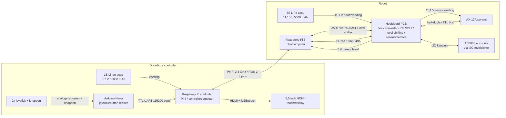

# Systeem-aansluitschema Robot + Controller

Dit document beschrijft het volledige elektrotechnische aansluitschema op systeemniveau. Het vult het bestaande `Aansluitschema Hoofdbord.png` aan met de samenhang tussen accu, hoofdbord, Raspberry Pi, servo's, encoders, controller en display.

## 1. Overzicht



## 2. Voedingsaansluitingen Robot

| Van | Naar | Spanning/stroom | Functie | Controlepunt |
|---|---|---:|---|---|
| 3S LiPo accu | Hoofdbord PCB, hoofdingang/XT60 | 11,1 V nominaal | Hoofdvoeding robot | Polariteit controleren voordat accu wordt aangesloten. |
| Hoofdbord PCB | AX-12A servo-bus | 11,1 V | Directe servo-voeding | Controleer dat GND gedeeld is met logica. |
| Hoofdbord buck converter | Raspberry Pi 5 | 5 V, minimaal 3 A | Voeding robotcomputer | Meet 5 V onder belasting. |
| Hoofdbord buck converter | Logica/interfacecomponenten | 5 V | 74LS241, level shifting en overige 5 V logica | Meet 5 V op testpunt. |
| Hoofdbord / Raspberry Pi | Sensorinterface | 3,3 V of 5 V volgens sensorprint | Voeding AS5600/TCA9548A | Controleer gekozen spanningsniveau met datasheets en PCB-schema. |
| Alle subsystemen | Gemeenschappelijke GND | 0 V | Referentie voor voeding en signalen | GND-continuiteit controleren tussen accu, PCB, Pi, servo's en sensoren. |

## 3. Signaalaansluitingen Robot

| Van | Naar | Signaal | Niveau/protocol | Functie |
|---|---|---|---|---|
| Raspberry Pi 5 TX | 74LS241 half-duplex buffer op hoofdbord | UART TX | 3,3 V naar bufferlogica | Servo-commando's naar AX-12A bus. |
| AX-12A bus / hoofdbord | Level shifter -> Raspberry Pi 5 RX | UART RX | 5 V TTL naar 3,3 V TTL | Servo-feedback veilig terug naar Pi. |
| 74LS241 buffer | AX-12A servo's | Half-duplex data | 5 V TTL, single-wire bus | Communicatie met Dynamixel/AX-12A servo's. |
| Raspberry Pi 5 SDA/SCL | TCA9548A I2C-multiplexer | I2C | 3,3 V logica | Selectie van encoderkanalen. |
| TCA9548A I2C-kanalen | AS5600 encoders | I2C | 3,3 V of 5 V volgens ontwerp | Positiefeedback per as. |
| Hoofdbord batterijbewaking | Raspberry Pi 5 / soft-shutdown ingang | Digitaal/analoog volgens schema | PCB-afhankelijk | Lage accuspanning detecteren en veilig uitschakelen. |

## 4. Voedings- en Signaalaansluitingen Controller

| Van | Naar | Spanning/signaal | Functie | Controlepunt |
|---|---|---|---|---|
| 1S Li-ion accu | Controller Raspberry Pi | 3,7 V via geschikte voeding/regelaar naar 5 V | Voeding controllercomputer | Controleer dat de Pi stabiel 5 V krijgt. |
| Controller Raspberry Pi | 5,5 inch display | HDMI + voeding/touch via USB of displaykabel | Beeld en eventuele touchinput | Controleer beeldweergave en touch/bediening. |
| Joystick 1 X | Arduino Nano A0 | Analoog | Linker joystick horizontaal | Waarde moet veranderen in seriele output. |
| Joystick 1 Y | Arduino Nano A1 | Analoog | Linker joystick verticaal | Waarde moet veranderen in seriele output. |
| Joystick 2 X | Arduino Nano A2 | Analoog | Rechter joystick horizontaal | Waarde moet veranderen in seriele output. |
| Joystick 2 Y | Arduino Nano A3 | Analoog | Rechter joystick verticaal | Waarde moet veranderen in seriele output. |
| Knoppen | Arduino Nano D2-D6, D8, D9, D11 | Digitaal met `INPUT_PULLUP` | Knopstatussen | Ingedrukt = LOW op pin, bit wordt 1 in outputmasker. |
| Arduino Nano D1/TX | Raspberry Pi GPIO15/RXD0, fysieke pin 10 | TTL UART, 115200 baud | Controllerdata naar Pi | Level shifter of spanningsdeler verplicht: Nano TX is 5 V. |
| Raspberry Pi GPIO14/TXD0, fysieke pin 8 | Arduino Nano D0/RX | TTL UART, 115200 baud | Optionele data van Pi naar Nano | Pi 3,3 V TX kan Nano RX meestal direct aansturen. |
| Arduino Nano GND | Raspberry Pi GND, fysieke pin 6 | GND | Gemeenschappelijke referentie | GND altijd verbinden. |
| Arduino Nano D13 | Passieve buzzer | Digitaal/PWM toon | Auditieve feedback bij knopdruk | Controleer polariteit van buzzer. |

## 5. Draadloze Verbinding Controller naar Robot

| Van | Naar | Medium/protocol | Data | Controle |
|---|---|---|---|---|
| Controller Raspberry Pi | Robot Raspberry Pi 5 | Wi-Fi 2,4 GHz | ROS 2 topics en services | Ping en ROS 2 discovery testen. |
| Controller | Robot | `/joy` of afgeleide controllerdata | Joystickassen en knoppen | Robot ontvangt live veranderende waarden. |
| Robot | Controller | `/robot/status` | Batterij, CPU, modus, foutcodes | Controller toont status. |
| Robot | Controller | `/robot/joint_states` | Servohoeken, snelheid, belasting/diagnostiek | Controller toont telemetrie. |
| Robot | Controller | `/camera/image_raw/compressed` | Gecomprimeerde videostream met AI-overlay | Display toont vloeiende videostream. |
| Controller | Robot | Heartbeat/failsafe-topic | Verbinding actief | Robot stopt veilig bij timeout. |

## 6. Serieel Controllerformaat Arduino Nano

De controllercode stuurt per sample een regel over UART:

```text
J,<x1>,<y1>,<x2>,<y2>,<buttonBits>
```

| Veld | Betekenis | Waardegebied |
|---|---|---|
| `x1` | Joystick 1 X | -1.000 tot 1.000 |
| `y1` | Joystick 1 Y | -1.000 tot 1.000 |
| `x2` | Joystick 2 X | -1.000 tot 1.000 |
| `y2` | Joystick 2 Y | -1.000 tot 1.000 |
| `buttonBits` | 8-bit knopmasker als decimaal getal | 0 tot 255 |

Knopmasker:

| Bit | Arduino-pin | Functie in code |
|---:|---|---|
| 0 | D3 | Switch1 |
| 1 | D4 | Switch2 |
| 2 | D5 | Switch3 |
| 3 | D6 | Switch4 |
| 4 | D8 | Switch1_2 |
| 5 | D9 | Switch2_2 |
| 6 | D11 | Switch3_2 |
| 7 | D2 | Switch4_2 |

## 7. Controlelijst Voor Montage

- [ ] Controleer polariteit van de 3S LiPo op de hoofdbord-ingang.
- [ ] Controleer dat de servo-voeding 11,1 V krijgt en niet via de Raspberry Pi loopt.
- [ ] Meet 5 V op de Raspberry Pi 5-voeding onder belasting.
- [ ] Controleer gemeenschappelijke GND tussen accu, hoofdbord, Raspberry Pi, servo's en sensoren.
- [ ] Controleer dat Raspberry Pi RX nooit direct 5 V van Arduino Nano of AX-12A bus krijgt.
- [ ] Controleer werking van de 74LS241 half-duplex buffer.
- [ ] Controleer I2C-communicatie met elke AS5600 via de TCA9548A multiplexer.
- [ ] Controleer UART-output van de controller: `J,<x1>,<y1>,<x2>,<y2>,<buttonBits>`.
- [ ] Controleer Wi-Fi-verbinding tussen controller en robot.
- [ ] Controleer dat de robot veilig stopt bij verbreken van Wi-Fi of heartbeat.

## 8. Nog Te Verifiëren Met Definitieve Hardware

De exacte connectornamen en pinnummers moeten worden vergeleken met de definitieve PCB-schema's/layouts:

- connectornaam hoofdingang accu;
- connectornaam servo-bus;
- connectornamen AS5600-encoderkanalen;
- exacte testpunten voor 11,1 V, 5 V, 3,3 V, UART TX/RX en I2C SDA/SCL;
- definitieve voeding van controllerdisplay en controller-Pi;
- definitieve mapping van joystick/knoppen naar robotfuncties.

## 9. Bronnen Binnen TOP

- `02_Schemas_PCB_Layouts/PCB hoofdbord/Aansluitschema Hoofdbord.png`
- `02_Schemas_PCB_Layouts/PCB hoofdbord/Schema_Hoofdbord.pdf`
- `02_Schemas_PCB_Layouts/PCB's Controller/Hoofdmodule/Schema_Hoofdmodule.pdf`
- `02_Schemas_PCB_Layouts/PCB's Controller/JoystickModule/Schema_JoystickModule.pdf`
- `01_Blokschemas/Blokschema van robot als geheel (inclusief controller)/Blokschema_Controller_Robot.drawio`
- `01_Blokschemas/Blokschema Interne werking robot/BlokschemaInterneRobot.drawio`
- `05_Controller_Software/Smartcontroller V2 - PI4+Arduino nano/main.cpp`
